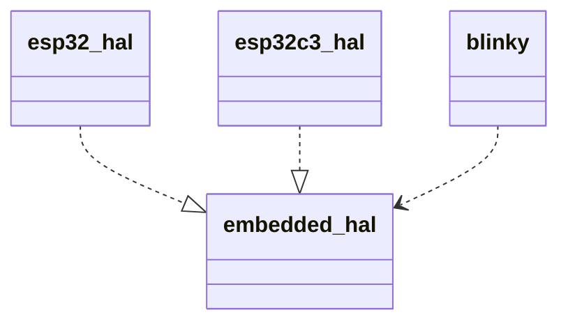
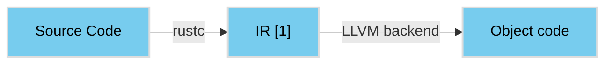
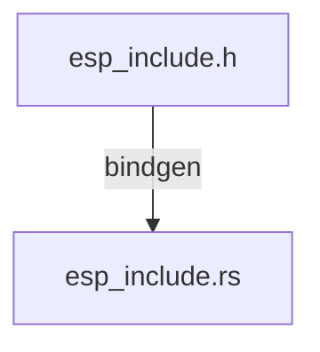
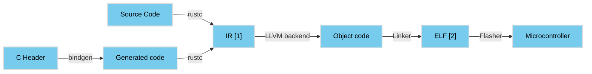
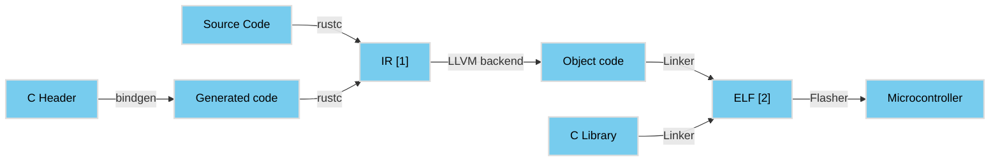

# Oh crab! 
# My watch speaks Rust 

Pierre-Yves Aillet


---

# Quelques rappels et définitions sur l'embarqué

Pas d'OS "classique"

- GPIO: General Purpose Input/Output
- I2C: Inter-Integrated Circuit
- SPI: Serial Peripheral Interface
- UART: Universal Asynchronous Receive/Transfer


---
layout: quote
author: Wikipedia
---

# 🦀 Rappels sur Rust

## **Rust** est un [langage de programmation](https://fr.wikipedia.org/wiki/Langage_de_programmation) compilé multi-[paradigme](https://fr.wikipedia.org/wiki/Paradigme_(programmation)) conçu et développé par Mozilla Research depuis 2010”, puis par la Rust Foundation

---

# 🦀 Rappels sur Rust

<br />
<br />

 - Memory safety - ownership
 - Type safety - explicit error handling, safe refactoring
 - Zero Cost Abstractions
 - Fearless concurrency
 - Great Developer eXperience

---
title: 🦀 Rappels sur Rust
titleRow: true
cols: 1-1
---

<p>
Structure d'un project

```
.
├── Cargo.toml
└── src
    └── main.rs
```
</p>
<p v-click>
Manipulations du projet

```sh
# Construction du projet
$ cargo build

# Lancement du projet
$ cargo run

# Formattage du code
$ cargo fmt
```
</p>

---
title: 🤔 Pourquoi Rust est adapté pour de l’embarqué ?
titleRow: true
cols: 2-1
---

 - no_std
   - core
   - alloc
   - std

::right::

```rust {all|1,2|8|6,17|14,18|all}
#![no_std]
#![no_main]

use esp32_hal::{clock::ClockControl, pac::Peripherals, prelude::*, Delay};
use esp_backtrace as _;
use std::fmt::println; // <= This is not possible with no_std :(

#[xtensa_lx_rt::entry]
fn main() -> ! {
    let peripherals = Peripherals::take().unwrap();
    let system = peripherals.DPORT.split();
    let clocks = ClockControl::boot_defaults(system.clock_control).freeze();

    let mut delay = Delay::new(&clocks);

    loop {
        println!("Hello world!");
        delay.delay_ms(1000u32);
    }
}
```

---
title: 🤔 Pourquoi Rust est adapté pour de l’embarqué ?
titleRow: true
cols: 2-1
---

 - no_std
 - Typestate pattern

::right::

```rust {9|9,12|9,14}
fn main() -> ! {
    let peripherals = Peripherals::take().unwrap();
    let system = peripherals.DPORT.split();
    let clocks = ClockControl::boot_defaults(system.clock_control).freeze();

    let mut delay = Delay::new(&clocks);

    let io = IO::new(peripherals.GPIO, peripherals.IO_MUX);
    let mut led = io.pins.gpio4.into_push_pull_output();

    loop {
        led.toggle().unwrap();
        delay.delay_ms(1000u32);
        println!("Led is high: {}", led.is_high());
    }
}
```

---
title: 🤔 Pourquoi Rust est adapté pour de l’embarqué ?
titleRow: true
cols: 2-1
---

 - no_std
 - Typestate pattern

::right::

```rust {all|1,2|3-5|8-10,16-19|11-13,20-22|all}
struct Output {}
struct Input {}
struct Gpio4<STATE> {
  _state: PhantomData<STATE>,
}

impl<T> Gpio4<T> {
  fn into_input(self) -> Gpio4<Input> {
    Gpio4 { _state: PhantomData }
  }
  fn into_output(self) -> Gpio4<Output> {
    Gpio4 { _state: PhantomData }
  }
}

impl Gpio4<Input> {
  fn is_high() -> bool { unimplemented!() }
}

impl Gpio4<Output> {
  fn toggle(&mut self) {}
}
```

<style>
.slidev-layout.default {
  background-image: none;
}
</style>

---
title: 🤔 Pourquoi Rust est adapté pour de l’embarqué ?
titleRow: true
cols: 2-1
---

- no_std
- Typestate pattern
- Ownership, &mut unique

::right::

```rust {all|1-3|5-9|14-16|18|all}
struct Blinker {
  led: Gpio4<Output>
}

impl Blinker {
  fn run() {
    // [...]
  }
}

fn main() -> ! {
    // [...]

    let mut led = io.pins.gpio4.into_push_pull_output();
    let blinker = Blinker { led };
    blinker.run();

    led.into_input();

    // [...]
}
```

<!--
Expliquer que la valeur représentant le matériel n'a qu'un owner à un instant donné donc pas possible de se retrouver avec un l'élément qui aurait changer de configuration
Parler de https://docs.rs/embedded-hal/1.0.0-alpha.9/embedded_hal/spi/index.html ?
-->

<style>
.slidev-layout.default {
  background-image: none;
}
</style>

---
title: 🤔 Pourquoi Rust est adapté pour de l’embarqué ?
titleRow: true
cols: 2-1
---

- no_std
- Typestate pattern
- Ownership, &mut unique
- Gestion des dépendances et<br/>
  compilation conditionnelle

::right::

```rust {all|9|11,13|15-17|all}
[package]
name = "blinky"
version = "0.1.0"
authors = ["Pierre-Yves Aillet <pyaillet@gmail.com>"]
edition = "2021"
license = "MIT OR Apache-2.0"

[dependencies]
esp32-hal = "0.5.0"

esp-backtrace = { version = "0.2.0", features = ["esp32"] }

xtensa-lx-rt = { version = "0.13.0", features = ["esp32"] }

[features]
default = ["rt"]
rt = ["xtensa-lx-rt"]
```

<!--
Expliquer l'utilisation de drivers sous forme de crate + les features
-->

---
title: 🤔 Pourquoi Rust est adapté pour de l’embarqué ?
titleRow: true
cols: 2-1
---

- no_std
- Typestate pattern
- Ownership, &mut unique
- Gestion des dépendances et<br/>
  compilation conditionnelle
- Abstractions

::right::



<!--
Ajouter un slide pour expliquer brièvement les traits

esp-idf-hal -> impl embedded-hal
\*-driver -> use embedded-hal (exemple I2C/SPI)
embedded-graphics
-->

---
title: 🤔 Pourquoi Rust est adapté pour de l’embarqué ?
titleRow: true
cols: 2-1
---

- no_std
- Typestate pattern
- Ownership, &mut unique
- Gestion des dépendances et<br/>
  compilation conditionnelle
- Abstractions

::right::

```rust {all|1-4|6-11|13-17|all}
// in embedded-hal
pub trait OutputPin {
    fn set_high(&mut self);
}

// in esp32-hal
impl OutputPin for Gpio4 {
    fn set_high(&mut self) {
        // specific code
    }
}

// in blinky
fn blink(mut led: impl OutputPin) {
    led.set_high();
}
```

<!--
Ajouter un slide pour expliquer brièvement les traits

esp-idf-hal -> impl embedded-hal
\*-driver -> use embedded-hal (exemple I2C/SPI)
embedded-graphics
-->


---
title: 🫤 Mais...
titleRow: true
cols: 1-1
---

- Il manque certaines abstractions
   - de base : interrupt, DMA, ...
   - de haut niveau : Bluetooth, WiFi[1]
   
[1] c'est en cours... [embedded_svc](https://github.com/esp-rs/embedded-svc)


---

# ⌚️ Qu’est-ce que c’est que cette montre ?


---
title: ⌚️ Qu’est-ce que c’est que cette montre ?
titleRow: true
class: text-center
cols: 2-3
---


ESP32 / ESP32-S\*
<br />


Architecture: xtensa-lx6
<br />
Licensed from Tensilica

::right::

ESP32-C\*
<br />


Architecture: RISC-V
<br />
Open standard instruction set architecture

---

# La construction du firmware, comment ça fonctionne ?


<br />
<br />
<br />

---

# La construction du firmware, comment ça fonctionne ?



<br />
<br />
<br />

- [1] IR: Intermediate Representation


---

# La construction du firmware, comment ça fonctionne ?


<br />
<br />
<br />

- [1] IR: Intermediate Representation
- [2] ELF: Executable and Linkable Format


---

# La construction du firmware, comment ça fonctionne ?


<br />
<br />
<br />

- [1] IR: Intermediate Representation
- [2] ELF: Executable and Linkable Format

---
title: 🛠 Tooling
titleRow: true
cols: 2-1
---

 - toolchains et crosscompilation

::right::

```sh {all|11|2,3|4-7|8-10|all}
❯ rustup target list
aarch64-unknown-linux-gnu
aarch64-unknown-linux-musl
aarch64-unknown-none
aarch64-unknown-none-softfloat
riscv32i-unknown-none-elf
thumbv6m-none-eabi
wasm32-unknown-emscripten
wasm32-unknown-unknown
wasm32-wasi
x86_64-apple-darwin (installed)
x86_64-apple-ios
x86_64-fortanix-unknown-sgx
x86_64-fuchsia
x86_64-linux-android
```

<!--
Sur une toolchain custom : rustc --print target-list
Sur une classique : rustup target list
Lister les toolchains : rustup toolchain list
-->

---

# 🛠 Tooling 

L’architecture xtensa n’est pas supportée par le compilateur rustc…
<br />
<div v-click>
  Parce que le backend xtensa n’existe pas côté llvm…
  <br />
</div>
<div v-click>
  MAIS !
  <br />
  C’est en cours…
  <br />
</div>
<div v-click>
  Depuis 3 ans…
  <br />
  <br />
</div>
<div v-click>
  Malgré tout, il y a eu des progrès prometteurs dernièrement 🎉
</div>
<div v-click>

-- https://discourse.llvm.org/t/rfc-request-for-upstream-tensilica-xtensa-esp32-backend/65355

-- https://lists.llvm.org/pipermail/llvm-dev/2019-March/130796.html
</div>


---

# 🛠 Tooling 

- Toolchain custom avec un fork maintenu de llvm et rustc
  - https://github.com/esp-rs/rust-build.git
  - https://github.com/espressif/llvm-project
  - https://github.com/esp-rs/rust

- Installation de la toolchain custom avec un outil dédié [espup](https://github.com/esp-rs/espup) :

```sh
cargo install espup --git https://github.com/esp-rs/espup
espup install
. export-esp.sh
```

---

# 🛠 Tooling 

Création d’un nouveau projet
  - `cargo generate https://github.com/esp-rs/esp-template`

---

# Avec tout ça on est prêts ?

<p v-click>
  Pas vraiment...

  La gestion du WiFi et du Bluetooth, c’est compliqué… 
</p>

---

# FreeRTOS et esp-idf à la rescousse

> FreeRTOS is a market-leading real-time operating system (RTOS) for microcontrollers and small microprocessors.

<cite>https://freertos.org</cite>

<br />
<br />

> ESP-IDF is the official development framework for the ESP32, ESP32-S and ESP32-C Series SoCs.

<cite>https://docs.espressif.com/projects/esp-idf/en/latest/esp32/</cite>

---

# FreeRTOS et esp-idf à la rescousse


<!--
On va utiliser des wrappers Rust autour du C
Insister sur la signification du unsafe et montrer un exemple https://github.com/esp-rs/esp-idf-hal/blob/5d1aea58cdda195e20d1489fcba8a8ecb6562d9a/src/gpio.rs#L988
-->

---

# FreeRTOS et esp-idf à la rescousse

- SPI/I2C/I2S
- Gestion des tasks
- Eventloop
- Bluetooth/BLE
- WiFi
- Timer
- ...

---

# 🛠 Tooling


<!--
Expliquer le principe des crates *-sys et des safe wrappers
https://www.youtube.com/watch?v=pePqWoTnSmQ
-->

---
title: 🛠 Tooling
titleRow: true
cols: 2-1
---

- toolchains et crosscompilation
- bindgen

::right::



---

# 🛠 Tooling

- toolchains et crosscompilation
- bindgen



<!--
https://www.youtube.com/watch?v=pePqWoTnSmQ
https://rustc-dev-guide.rust-lang.org/overview.html
-->

---

# 🛠 Tooling

- toolchains et crosscompilation
- bindgen
- build.rs



<!--
https://www.youtube.com/watch?v=pePqWoTnSmQ
https://rustc-dev-guide.rust-lang.org/overview.html
-->

---
title: 🛠 Tooling
titleRow: true
cols: 2-1
---

- toolchains et crosscompilation
- bindgen
- build.rs
- espflash et espmonitor

::right::


<style>
.slidev-layout.default {
  background-image: none;
}
</style>
---

# Démo


---
title: 🛠 Tooling
titleRow: true
cols: 2-1
---

- toolchains et crosscompilation
- bindgen
- build.rs
- espflash et espmonitor
- devcontainer + esp-web-flash

::right::


<style>
.slidev-layout.default {
  background-image: none;
}
</style>
---
title: 🛠 Tooling
titleRow: true
cols: 2-1
---

- toolchains et crosscompilation
- bindgen
- build.rs
- espflash et espmonitor
- devcontainer + esp-web-flash
- wokwi

::right::


<style>
.slidev-layout.default {
  background-image: none;
}
</style>
---

# 🔮 Next? Sur la montre…

 - BLE et connexion avec le téléphone
 - Détection d’activité

<!--
https://github.com/pyaillet/twatch-idf-rs#description
https://github.com/pyaillet/esp-idf-ble
-->

---

# 🔮 Next? Rust embedded

<v-clicks at="0">

 - async/await avec embassy - https://github.com/embassy-rs/embassy
 - Autres cartes - Apache MyNewt + NimBLE - https://mynewt.apache.org/
 - RTIC - Real Time Interrupt driven Concurrency - https://rtic.rs/1/book/en/

</v-clicks>

---

# Crédits

 - Gentilhomme icônes créées par [Freepik - Flaticon](https://www.flaticon.com/fr/icones-gratuites/gentilhomme)
 - [#esp-rs:matrix.org](https://matrix.to/#/#esp-rs:matrix.org)
 - Developing Embedded Rust https://www.youtube.com/watch?v=EughbCeVVxw
 - Rust sur de l’IOT ? https://www.youtube.com/watch?v=pl60zczUXt0
 - Build scripts https://www.youtube.com/watch?v=pePqWoTnSmQ


---

# Ressources / Références

 - [Rust Embedded Workgroup](https://github.com/rust-embedded/wg)
 - [Embedded Rust book](https://docs.rust-embedded.org/book/)
 - [Awesome embedded Rust](https://github.com/rust-embedded/awesome-embedded-rust)
 - [esp-rs book](https://esp-rs.github.io/book/)
 - [Blog de Scott Mabin](https://mabez.dev/blog/posts/)
 - [Explication du Typestate pattern](http://cliffle.com/blog/rust-typestate/) chez Cliff L. Biffle
 - [Explication d’un principe identique au typestate pattern pour un builder](https://lafor.ge/builder-rust/) chez [Akanoa](https://twitter.com/_akanoa_)
 - [Documentation officielle de esp-idf](https://docs.espressif.com/projects/esp-idf/en/latest/esp32/)
 - [Organisation esp-rs](https://github.com/esp-rs) (et tous les projets liés sur Github)
 - [FreeRTOS](https://www.freertos.org/)
 - [Site officiel de la montre](http://www.lilygo.cn/products.aspx?TypeId=50053&FId=t3:50053:3)

---

# Questions ?
